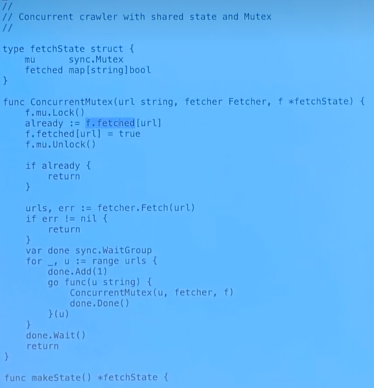
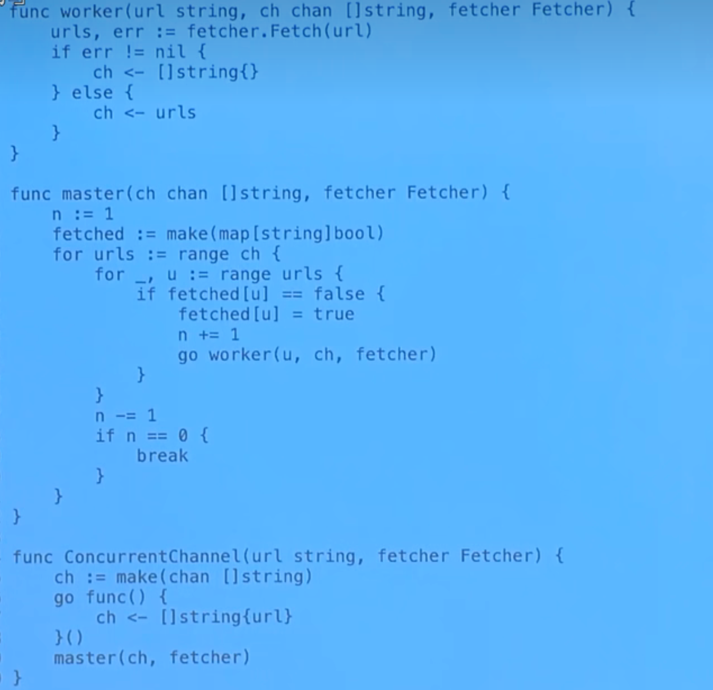
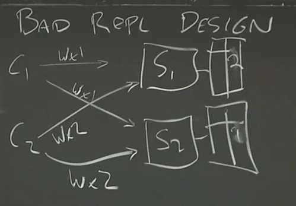
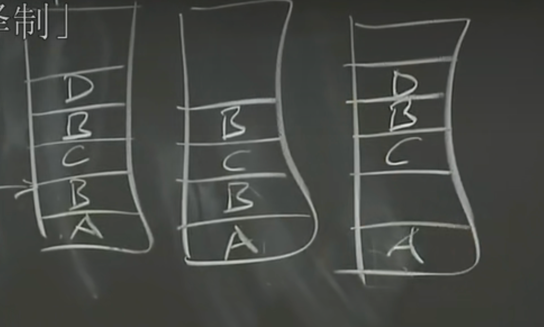
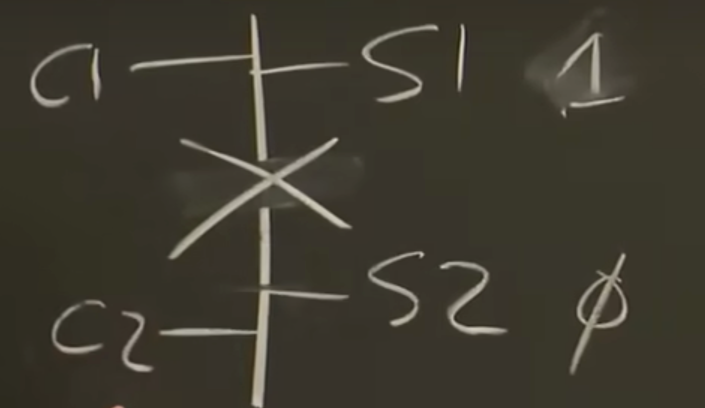
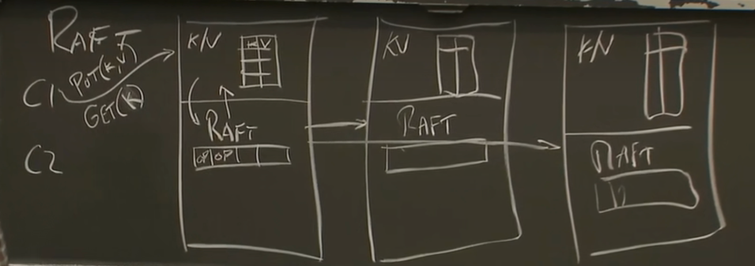

# 课程介绍
分布式的目的
- 并行度
- 容错
- 物理原因：物理上是分开的
- 安全性

分布式的挑战
- 并发
- partial failure（容错能力）：上千台电脑意味着小概率的错误变成了常见问题，故障总会出现
  - 可用性：某些故障时仍提供完好服务，太多故障仍不可用
  - recoverability：可恢复性，太多故障时可以采取措施恢复过来
  - 实现手段
    - 非易失性存储-写入慢
    - replication 复制
- performance - 可拓展性
- 一致性。多个数据副本的一致性（强弱）：更强的一致性意味着更多的通信，更大的 cost

基础架构-需要进行抽象
- 存储
- 计算
- 通信

lab
1. mapreduce
2. raft
3. k/v service
4. shard k/v service (分片)

# MapReduce

背景：大数据 TB 级别计算，并提供一个隐藏细节的框架，供业务开发人员使用

瓶颈：文件传输带来的带宽限制，如执行 map 时 master 要去分发数据，或者 worker 要去文件系统请求数据

优化
- 本地优化-> mapreduce 和 分布式文件系统一起部署，当需要对某个 input 执行 map 时，master 会去对应机器拉起 worker 直接本地执行 map（不过现在网络很快了，没这个优化也可以）

shuffle ：将各个 map 中相同的 key 汇聚到 reduce 中，这一步网络通信则不可避免


# Go 多线程 RPC
go的优点：
- 方便进行线程同步/锁机制
- 方便的 RPC 包
- 类型安全，内存安全
- 垃圾回收

goroutine 其实就是线程（程序计数器+一组寄存器+栈）main 其实就是 goroutine

为什么分布式关心多线程
- 可以实现并发 IO
- 多核并行
- 便利：如周期性检查

事件驱动编程(异步编程)也可以实现并发 IO：一条线程，一个循环（如 epoll） 
- 循环里会等待，获取到数据包后，判断它来自哪一个客户端。
- 优点是开销小高效（线程创建销毁调度的开销）
- 多核 CPU 可开多个线程，每个线程使用 异步IO

进程 与 线程
- 运行 go 时会创建一个 unix 进程并开辟地址空间，创建 gorotine 时就相当于创建了线程。
- 进程间地址独立，不可访问。线程见地址内存可以交互- 通过channle mutex 等

多线程的挑战
- Race：共享内存时，存在并发问题- 通常用锁解决，或者就不共享内存了
- coordination：(同步) 线程间协作 - channel sync.cond sync.waitgroup (java condition)
- Deadlock

网络爬虫 Code

DFS:

lock:



同步实现:




# GFS

### 导读

大型分布式存储需要考虑什么？（why hard）

- performance -> 那么就要考虑如何进行数据拆分，即 sharding
- 分片带来 fault -> 解决 fault 即需要 tolerance
- tolerance 的实现 -> replica
- repl 带来的问题 -> in consistency
- 为了保证一致性带来的问题 -> low performance

糟糕的 replica 设计：



一旦 2 个副本响应两个 client 的顺序不同，或者某个请求 down 了。都会导致 replica 数据不一致

GFS 的目标
- big & fast
- global: 可复用的存储系统（一套文件系统，而不是多套）
- sharding : 分片大数据，以得到高吞吐
- 自动故障恢复
- google 自己的场景：大文件连续访问（非随机访问

论文提出的一些关键点
- 存储系统可以具备若弱一致性
- 单一 master

### GFS 架构

Master + chunk 服务器 （分离了存储和元信息管理）
- master 负责文件命名+查询 chunk 位置
- chunk 服务器负责数据存储
- 每个文件被拆分成 64M 的多个 chunk 存储在多个 chunk 服务器中

Master 数据
- file name - chunk handles(标识符) 的数组 （映射关系） nv(非易失性，需存储到磁盘)
- chunk handle - 以下信息
  - chunk server 的列表（多副本） v
  - version    nv
  - primary    v
  - lease 过期时间  v

Master 如何故障恢复：log checkpoint - 持久化到 disk

Read 步骤
1. Client 发送 fileName + offset 请求 master
2. master 返回 handle 与 chunk server 列表
3. Client 查看是否有缓存，没有选择一个 chunk server 请求 chunk （可以是任何 chunk server ，不一定是 primary）
4. chunk server 返回 chunk 对应数据
5. （一般有一层 library-获取到 chunk 后，library 负责获取 chunk 中的所需数据返回给 client）

Write 步骤

0. client 发送写请求，master 基于文件名找到 chunk

1. 没有 primary 的场景 - 以下在 master 上进行
  - master 找到最新的 chunk 副本：根据 version,master 会忽略比 version 更小的 repl。
  - 从中选择一个 chunk 为 primary ，其他为 secondary
  - 增加版本号
  - 告诉 chunk 副本 谁是 primary 与新的版本号（还会有 lease，如60s过期时间）
  - master 将版本号写入磁盘持久化

（版本号是为了选择最新的副本，过期时间是为了防、
双主- primary 挂了然后重启导致双主，或是网络分区导致了双主，等待一个 lease 的时间再去选主，就能保证旧的主过期了）

（当然，还有一些其他防止双主的方法，如一些选举机制-半数以上支持才能当主）


2. 然后基于 1PC 进行写入（GFS没有回滚） - 以下在获取到 primary 后，client 请求 primary,primary 的执行过程
  - primary 找到 offset
  - primary  secondary 都在该 offset 写入
  - secondary 成功返回 yes
  - 所有都成功了 primary 给客户端返回 yes，否则 error
  - 注意：如果部分成功，成功的那部分在 GFS 中不会进行回滚。依赖于 client 重试达到一致


这种写入方式会带来一些数据在副本上丢失：



该图对应操作如下：
1. client1 成功写入 A
2. client2 写入 B 时一个副本失败，但 primary 和另一个副本不回回滚
3. client3 成功写入 C
4. client2 重试写入 B
5. client5 写入 D,发生失败且不重试


GFS 允许这种数据错误。那么如何实现更强一致性的分布式存储呢？
- 可以让 primary 做重复检查
- 使用 2PC

GFS 存在的问题
- 单一 master : 存储文件对应关系的内存有限，client 压力过大，弱一致性语义不是很多应用都可以使用

# Replication (主从备份-容错)

解决什么问题
- fail-stop (指那些能使计算机完全停止工作的错误-如断电，断网，关键硬件损坏)
- 不包括: 软件 bugs (如错误的计算结果)


方案
- 方案1：state transfer （memory）: 主向备发送状态，这里的状态可以表示内存中的数据或是变更数据。
- 方案2：Replicated state machine (op)：主向备发送外部事件操作，而不发送实际状态。（如：logging channel）

方案2可能不适用于多核服务器，因为指令顺序可能就不同，并发下就可能导致不同的结果。

如何设计 Replicated state machine ，需要考虑如下问题
- 复制哪些状态
- 主备需要保持多紧密的同步
- 如何切换
- 如何处理异常
- replica down 时如何生成新的

复制哪些状态：
- 多数场景：应用层的状态即可，如 GFS 只需复制 chunk 信息
- 少数场景：复制机器层面的状态：如内存，寄存器中的内容（不高效）

可能发生的非确定性事件
- input: 输入时通过外部数据包，读数据包会发起中断。主备中断的在哪条指令需要保持一致。
- 特殊指令：如随机数
- 多核并行（最好不用多核）

log entry
从主发送到从的状态事件操作被称为 log entry，其格式需要包含。·
- 指令号
- 类型（输入/其他指令）
- 数据

output rule
- 通过 1 pc, backup ack 后 primary 才能返回给 client 输出（影响性能）
- 主从切换可能导致多个输出（主从都输出了）client 需要去重逻辑（一种方式是丢弃相同 TCP 序列的包）

主备无法通信，会导致脑裂
- 需要外部系统来判断（如zk可以加锁，让其只能有一个主）

# Go threads and raft

### Go 同步机制

1. 闭包（环境+匿名函数）:其中对外层函数的调用都是指针传递。 waitgroup ：类似 countdownlatch
```
func main() {
	var a string
	var wg sync.WaitGroup
	wg.Add(1)
	go func() {
		a = "hello"
		wg.Done()
	}()
	wg.Wait()
	print(a)
}
```
如果不想指针传递，则可以通过传入参数的方式来实现。
```
func main() {
    var a string
    var wg sync.WaitGroup
    wg.Add(1)
    go func(a string) {
        *a = "hello"
        wg.Done()
    }(a)
    wg.Wait()
    print(a)
}
```
2. mutex
> 建议在读写共享变量的同时，加锁。不加锁的话需要去思考 happens-before 原则写出正确的代码，加锁的话可以避免这种麻烦。

错误的方式
```
func main() {
	counter := 0
	for i := 0; i < 1000; i++ {
		go func() {
			counter++
		}()
	}
	time.Sleep(1 * time.Second)
	print(counter)
}
```

利用 mutex 加锁：将某一段变为原子操作
```
func main() {
    var counter int
    var wg sync.WaitGroup
    var mutex sync.Mutex
    wg.Add(1000)
    for i := 0; i < 1000; i++ {
        go func() {
            mutex.Lock()
            counter++
            mutex.Unlock()
            wg.Done()
        }()
    }
    wg.Wait()
    print(counter)
}
```

3. condition variable (条件变量)

> 比如实现半数赞成即成为 leader 的投票

```
mutex.Lock()
// do something that might affect the condition
cond.Broadcast()  // cond.signal() will wake up one thread
mutex.Unlock()

---

mutex.Lock()
while condition == false {
  cond.Wait()
}
`// now condition is true, and we have the lock
mutex.Unlock()
```

4. channel： 同步机制，如果没有数据则阻塞，如果有数据则取出。channel 有 buffered 和 unbuffered 两种，buffered 可以存储数据，unbuffered 不存储任何数据。

```
func main() {
    ch := make(chan int)
    go func() {
        time.Sleep(1 * time.Second)
        <-ch
    }()
    start := time.Now()
    c <- true // it will block until the other goroutine receives the value
    fmt.Println("send took:", time.Since(start))
}
``` 


deadlock example （unbuffered channel）
```
c := make(chan int)
c <- 1
<-c
```

使用场景
- 生产者消费者
- 实现类似 waitgroup 的功能

```
func main() {
	done := make(chan bool)
	for i:=0; i<5; i++ {
        go func(x int) {
            sendRPC(x)
            done <- true
        }(i)
    }
    for i:=0; i<5; i++ {
        <-done
    }
}

func sendRPC(i int) {
    fmt.Println(i)
}
```

# 容错-RAFT (lecture)

背景：
GFS 只有一个 master, 主备自己无法自动切换。因此我们需要一个服务来决定谁是主，并且要避免脑裂！

### test-and-set 服务 (课程)

是什么：test-and-set 基于锁（CAS） 操作来决定谁是主。当向它发送请求，它会维护一个状态位（0/1）。当请求状态是0时，会修改为1，并返回可以成为主；当状态是1时，返回不能成为主。

存在的问题
- test-and-set 自身会成为单点故障
- 如果 test-and-set 也实现容错。那么当产生分区时，就可能脑裂。两个请求主的服务分别只和 test-and-set 的某一个节点通信，且 test-and-set 节点之间也分区了。那么都会认为自己是主。



如何解决脑裂(paxos vsr 实现了)
- 使用少数服从多数解决脑裂：2n+1 的服务器可以承受 n 个服务器故障。
- 使用 term


### Raft 与 replication 服务架构 （课程）

以库的方式内置在 replication 系统中（如 kv 服务），帮助服务管理 replicated state (kv 服务的 hash 表)
其架构如下：
1. client 请求 leader 服务
2. 服务下发到 raft (通过 start 函数)
3. raft 开始执行：以 log 方式，发送心跳（append entry） raft peer
4. 得到大多数同意 raft 可以提交到服务其上
5. 服务响应 client
6. raft leader 会在下一次心跳中（append entry），告知 commit 信息，follower 就能够进行提交



### RAFT 定义与特点 (论文)
> [Raft](https://raft.github.io/) is a consensus algorithm that is designed to be easy to understand. It’s equivalent to Paxos in fault-tolerance and performance. The difference is that it’s decomposed into relatively independent subproblems, and it cleanly addresses all major pieces needed for practical systems. We hope Raft will make consensus available to a wider audience, and that this wider audience will be able to develop a variety of higher quality consensus-based systems than are available today.

1. 什么是 consensus algorithm

共识是具备容错的分布式系统的一个基础问题。共识算法就是帮助多个节点之间达成一致的决议。共识算法需要在多数节点存活时正常工作

共识算法与 replicated state machines 经常一起出现。replicated state machines 是构建主备的一种方式。每个服务有一个 state machine 与一个 log
- state machine： 想要构建容错的组件，比如 GFS 的 chunk
- log: 记录输入命令，一般称为 log entry

2. RAFT 的特点（相比与 PAXOS）

raft 的最主要目标：易于理解与引用
- 拆分 raft 为多个可单独解决的子问题： leader election, log replication, safety and membership changes
- 减少需要考虑的状态：使用随机初始化 election timeout 来简化 leader election 算法

### RAFT leader election (论文+课程)
> 使用心跳机制触发选举

leader 的一个原则
- 

leader 心跳机制
- leader 以 heartbeat timeout 为间隔发送 Append Entries（可能会带 log entry）
- 若 leader 宕机。则 follower 会在 election timeout 后仍收不到心跳，此时触发选举

心跳处理
- 若非 follower 收到来自 leader 的心跳，则比较任期，如果任期不大于，则转为 follower
- 若follower 收到 Append Entries，则重置 election timeout。若任期小则更改任期

触发选举
- follower 增加 term，并切换为 candidate
- 投自己一票。然后并发发出 Request Vote 到其他节点
- 等待结果
  - 若收到大多数节点的投票，则成为 leader
  - 若收到的结果 term 更高，则切换为 follower
  - 超过 election timeout 未达到半数票（存在其他 candidate 导致 split vote），则会进行重试
- 选举期间收到心跳：若任期 >= 自己的 ，就认为 leader 合法，自己停止选举，切换为 follower

投票原则
- 每个节点在任期内只能投一票，遵循先来先得原则
- 只投给 log 比自己新的：1. 最后一个条目的任期号大于等于自己的节点；或是任期相同且 log index 更大的节点，
- 投票后重置 election timeout


随机算法解决 split vote
- election timeout 会随机化，尽量避免同时选举。并保证如果出现同时选举能快速解决。
- election timeout 最佳实践：[心跳时间2倍，3-4倍]

网络分区场景：
- 多数选举机制可以防止网络分区的脑裂
- 如果 leader 被分区了，那么当它重新加入网络时，它会被其他节点认为是过期的 leader，因此会被降级为 follower

### Raft 日志恢复机制

日志在故障情况下可能会不一致，leader 会让日志逐渐趋向一致。实现方式如下？

假设目前日志如下,index 从 0 开始（数字表示任期），且现在 server3 为leader
```
         0 1 2 3
server1：3
server2: 3 3 4
server3: 3 3 5
```

1. leader 增加 6
```
         0 1 2 3
server1：3
server2: 3 3 4
server3: 3 3 5 6
```

2. leader 发送 appendentry，维护以下信息 nextindex[s2] = 3, nextindex[s1] = 3 （下一个 index），并发送
  - prevlogindex = 2
  - prevlogterm=5 
  - entry[] : 所有在 prevlogindex 后的 enrty

3. s2 收到心跳。检查 prevlogindex 中是否满足 prevlogterm 。这里 4！=5 ，因此会返回 false (同理 s1)
4. leader 收到 false，会减小index：nextindex[s2] = 2, nextindex[s1] = 2 并发送
  - prevlogindex = 1
  - prevlogterm= 3

5. s2 收到心跳，检查 index 1通过，则更新所有 entry
```
         0 1 2 3
server1：3
server2: 3 3 5 6
server3: 3 3 5 6
```

6. s1 则会在下一轮中类似更新

```
         0 1 2 3
server1：3 3 5 6
server2: 3 3 5 6
server3: 3 3 5 6
```

这样一个一个回滚的方式适用于大多数场景，但效率较低。可以参考论文 5.3 看如何优化。


**日志中的一个原则**：一致的日志若多过半数，就需要被提交。这就要求那些少数的日志不能当选 leader ，这由上文投票原则保证

如下面 s1 不能是 leader,因为8需要被提交
```
         0 1 2 3
server1：5 6 7 
server2: 5 8
server3: 5 8
```

### Raft persist

三个需要持久化的数据：
- log entry
- currentTerm
- votedFor

### Raft 日志压缩 与快照

raft 会要求应用程序在某一个 point 创建 snapshot 并持久化。这样该 point 前的日志可以被删除，节省空间。


问题:leader 创建 snapshot 后，之前的日志会被删掉。此时如果某个 follower 非常落后，它就没法同步到删掉部分的日志
方案： installSnapshotRPC —— 出现这个情况时会通过 installSnapshotRPC 发送快照信息+日志信息。


### Raft 正确性

Raft 理论上不能保证已提交的数据一定不会被回滚：

结果符合线性一致性即可认为正确（类似强一致性）

什么是 线性一致性